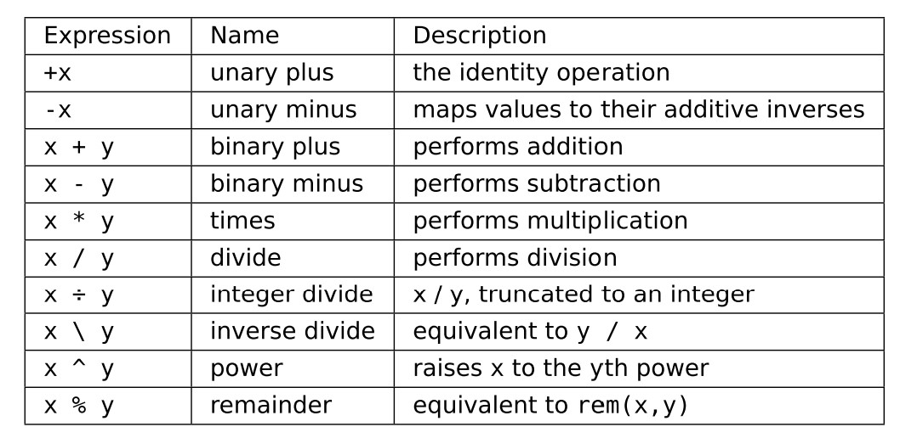

### 开始交互命令行

```
julia
include(file.jl) // 把行码串文件加进来
julia script.jl // 如果不想要交互式命令，可以直接运行
```

### 特别的浮点数
```
typeof(NaN)
typeof(Inf)
```
### 大整数

```
BigInt(typemax(Int64)) +1
```


### 数学运算



### Boolean Operators
```
!true 
!flase
true && pi==1
flase !! pi!= 2
```

### 对向量的 `.` 运算符
```
[1,2,3] .^2 
```

### 6.1复数

```
2 + 3im 
```
### 6.2有理数
```
2//3 
numerator(2//3)
denominator(2//3)
float(2//3) ==  2/3  // true
```

### 字符串
```
str = "long string"
str[1:4]
str2 = """Hello, world."""
```

### 7.4合并字符串
```
"I "*"love "*"you!"
```
### 7.5打印进字符串
```
a=[1,2,3,"hello"]
"$a"
```